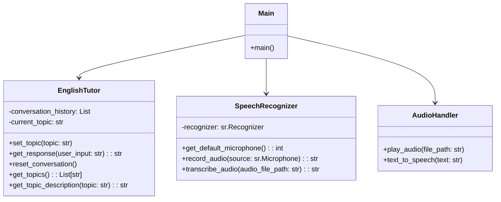
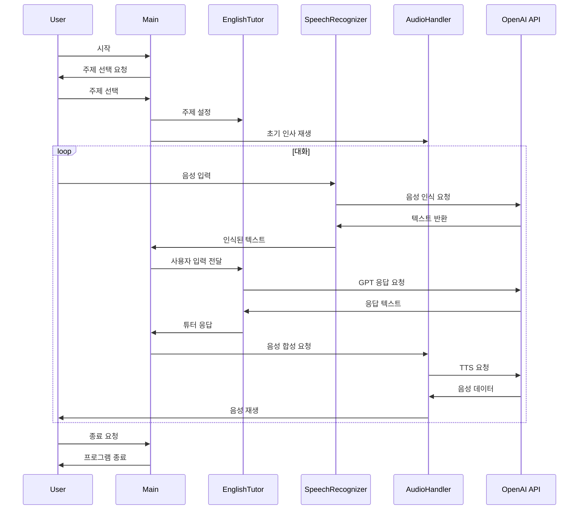

# AI 영어 튜터 프로젝트

## 프로젝트 개요

이 프로젝트는 OpenAI의 GPT 모델과 음성 인식/합성 기술을 활용하여 개인화된 영어 학습 경험을 제공하는 AI 영어 튜터 시스템을 구현합니다. 사용자는 다양한 상황 기반 대화 또는 자유 주제로 영어 회화를 연습할 수 있습니다.

## 주요 기능

- OpenAI Whisper API를 이용한 음성 인식
- GPT 모델을 활용한 상황별 영어 대화 생성
- 텍스트-음성 변환(TTS)을 통한 AI 튜터의 음성 응답
- 다양한 주제 및 상황 기반 학습
- 자유 주제 대화 모드 지원

## 기술 스택

- Python 3.8+
- OpenAI GPT-3.5 API
- OpenAI Whisper API
- SpeechRecognition 라이브러리
- PyAudio
- Pygame (음성 재생)

## 설치 방법

1. 저장소를 클론합니다:
   ```
   git clone https://github.com/JDeun/ai-english-tutor.git
   ```

2. 필요한 패키지를 설치합니다:
   ```
   pip install -r requirements.txt
   ```

3. OpenAI API 키를 설정합니다:
   - `.env` 파일을 생성하고 다음 내용을 추가합니다:
     ```
     OPENAI_API_KEY=your_api_key_here
     ```

## 사용 방법

1. 메인 스크립트를 실행합니다:
   ```
   python main.py
   ```

2. 프롬프트에 따라 학습 주제를 선택하거나 자유 주제를 선택합니다.

3. 마이크를 통해 영어로 대화를 시작합니다.

4. '종료'라고 말하면 프로그램이 종료됩니다.

## 개발 일지

### 2023-09-25
- 프로젝트 초기 구조 설계
- OpenAI API 연동 구현
- 기본적인 음성 인식 및 합성 기능 구현

### 2023-09-26
- 다양한 주제 및 상황 기반 학습 모드 추가
- 자유 주제 대화 모드 구현
- 프롬프트 엔지니어링을 통한 AI 튜터의 응답 품질 향상

### 2023-09-27
- OpenAI Whisper API 통합 (음성 인식)
- 코드 리팩토링 및 모듈화
- README 및 요구사항 문서 작성

## 핵심 기술 코드 샘플

### 1. 동적 주제 기반 프롬프트 생성 시스템

```python
class EnglishTutor:
    def __init__(self):
        self.conversation_history = []
        self.current_topic = None

    def set_topic(self, topic):
        self.current_topic = topic
        base_prompt = config.SYSTEM_MESSAGE
        if topic != "자유주제/대화":
            topic_prompt = f"""
Now we will practice English in the context of {topic}. 
Focus on common phrases and vocabulary related to this topic.
Remember to:
1. Use natural, conversational English appropriate for the {topic} context.
2. Introduce and explain key vocabulary and phrases specific to this situation.
3. Provide examples of how to use these phrases in real-life scenarios.
4. Correct any mistakes gently, explaining the correct usage.
5. Gradually increase the complexity of the language as the conversation progresses.
6. Encourage the learner to form complete sentences and express their thoughts fully.
7. Offer cultural insights relevant to {topic} in English-speaking countries when appropriate.
8. Ask questions to prompt the learner to use the new vocabulary and phrases.
9. Provide positive reinforcement and encouragement throughout the conversation.
10. Summarize key learning points at natural breaks in the conversation.

Maintain your friendly and supportive demeanor throughout the conversation, 
and adapt your language to the learner's proficiency level while challenging them to improve.
"""
            self.conversation_history = [{"role": "system", "content": base_prompt + "\n" + topic_prompt}]
        else:
            self.conversation_history = [{"role": "system", "content": base_prompt}]

    def get_response(self, user_input):
        self.conversation_history.append({"role": "user", "content": user_input})
        
        response = client.chat.completions.create(
            model=config.LLM_MODEL,
            messages=self.conversation_history,
            max_tokens=config.MAX_TOKENS,
            temperature=config.TEMPERATURE,
            top_p=config.TOP_P,
            frequency_penalty=config.FREQUENCY_PENALTY,
            presence_penalty=config.PRESENCE_PENALTY,
            stop=config.STOP
        )

        tutor_response = response.choices[0].message.content
        self.conversation_history.append({"role": "assistant", "content": tutor_response})
        
        return tutor_response
```

이 코드는 다음과 같은 핵심 기능을 구현합니다:
- 동적 프롬프트 생성: 선택된 주제에 따라 시스템 프롬프트를 동적으로 구성합니다.
- 상황별 학습 가이드: 각 주제에 대해 10가지 구체적인 지침을 제공하여 효과적인 학습 경험을 보장합니다.
- 대화 이력 관리: 대화의 맥락을 유지하며 일관된 학습 경험을 제공합니다.
- 유연한 모드 전환: '자유주제/대화' 모드와 특정 주제 모드 간의 원활한 전환을 지원합니다.

### 2. 음성 인식 및 전처리 시스템

```python
import speech_recognition as sr
from openai import OpenAI
import tempfile
import config

client = OpenAI(api_key=config.OPENAI_API_KEY)

class SpeechRecognizer:
    def __init__(self):
        self.recognizer = sr.Recognizer()

    def get_default_microphone(self):
        try:
            mic = sr.Microphone()
            return mic.device_index
        except Exception as e:
            print(f"기본 마이크를 찾는 중 오류 발생: {e}")
            print("사용 가능한 마이크 목록:")
            for index, name in enumerate(sr.Microphone.list_microphone_names()):
                print(f"마이크 {index}: {name}")
            return int(input("사용할 마이크의 번호를 입력하세요: "))

    def record_audio(self, source):
        print("말씀해 주세요...")
        try:
            audio = self.recognizer.listen(source, timeout=5, phrase_time_limit=10)
            with tempfile.NamedTemporaryFile(delete=False, suffix=".wav") as temp_audio_file:
                temp_audio_file.write(audio.get_wav_data())
                return temp_audio_file.name
        except sr.WaitTimeoutError:
            print("음성 입력 시간이 초과되었습니다.")
            return None
        except Exception as e:
            print(f"음성 녹음 중 오류 발생: {e}")
            return None

    def transcribe_audio(self, audio_file_path):
        with open(audio_file_path, "rb") as audio_file:
            transcription = client.audio.transcriptions.create(
                model=config.STT_MODEL,
                file=audio_file
            )
        return transcription.text
```

이 음성 처리 시스템은 다음과 같은 기능을 포함합니다:
- 자동 마이크 감지: 시스템의 기본 마이크를 자동으로 선택하거나 사용자에게 선택 옵션을 제공합니다.
- 실시간 음성 녹음: 사용자의 음성을 실시간으로 녹음하고 임시 파일로 저장합니다.
- 오디오 전처리: 녹음된 오디오를 OpenAI의 Whisper 모델에 적합한 형식으로 변환합니다.
- 음성-텍스트 변환: OpenAI의 Whisper API를 사용하여 고품질의 음성-텍스트 변환을 수행합니다.

### 3. 주제 기반 학습 관리 시스템

```python
from topic import topics

class EnglishTutor:
    # ... (이전 코드 유지)

    def get_topics(self):
        """
        사용 가능한 주제 목록을 반환합니다.
        """
        return [list(topic.keys())[0] for topic in topics]

    def get_topic_description(self, topic):
        """
        선택된 주제에 대한 설명을 반환합니다.
        """
        for t in topics:
            if list(t.keys())[0] == topic:
                return list(t.values())[0]
        return "해당 주제에 대한 설명이 없습니다."
```

이 시스템은 다음과 같은 기능을 제공합니다:
- 다양한 학습 주제 관리: 여러 가지 상황별 영어 학습 주제를 제공합니다.
- 동적 주제 정보 제공: 각 주제에 대한 설명을 동적으로 제공하여 사용자의 선택을 돕습니다.
- 확장 가능한 주제 구조: 새로운 학습 주제를 쉽게 추가하고 관리할 수 있는 구조를 제공합니다.

## UML 다이어그램

### 클래스 다이어그램



### 시퀀스 다이어그램



## 향후 계획

1. 로컬 Whisper 모델 통합: 
   - 현재는 OpenAI Whisper API를 사용하고 있지만, 향후 로컬에서 Whisper 모델을 실행하여 성능을 향상시킬 계획입니다.
   - 이를 통해 네트워크 지연을 줄이고 오프라인 사용이 가능해질 것입니다.

2. 사용자 피드백 시스템 구현:
   - 학습자의 진행 상황을 추적하고 개인화된 학습 경험을 제공하기 위한 피드백 시스템을 구현할 예정입니다.

3. 다국어 지원:
   - 현재는 한국어와 영어만 지원하지만, 향후 다양한 언어로 확장할 계획입니다.

4. 인터페이스 개발:
   - 사용자 경험을 개선하기 위해 모바일 앱 기반 인터페이스를 개발할 예정입니다. 이 프로젝트는 247_word(https://github.com/JDeun/247word_project)에 결합될 예정입니다.

## 기여 방법

이 프로젝트에 기여하고 싶으시다면:

1. 이 저장소를 포크합니다.
2. 새 브랜치를 생성합니다 (`git checkout -b feature/AmazingFeature`).
3. 변경사항을 커밋합니다 (`git commit -m 'Add some AmazingFeature'`).
4. 브랜치에 푸시합니다 (`git push origin feature/AmazingFeature`).
5. Pull Request를 생성합니다.
